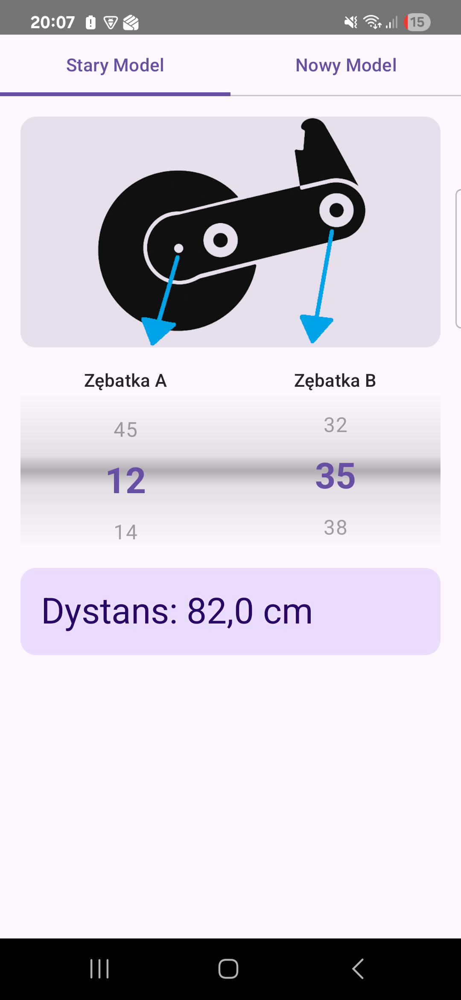
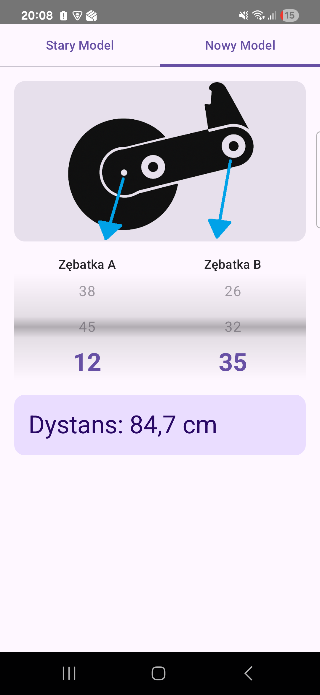

<div>

# Ferrari Plant Spacing Distance Table

**Instant gear ratio calculator for Ferrari planters – Old & New models**

[](http://www.wtfpl.net/about/)
[](https://developer.android.com)
[](https://kotlinlang.org)



</div>

---

## Features

- **Full gear list** – Select any Gear A or B
- **Two models supported**:
    - **Old Model** (`k = 30`) which means old machine like from 2004
    - **New Model** (`k = 29`)
- **Smart calculation**:
    - From built-in database
    - Fallback formula: `distance = k × B / A`
- **Intuitive wheel pickers** – Swipe to choose, like date of birth
- **Zero permissions** – No internet, no tracking, no ads

---

## Screenshots

| Old Model                         | New Model                         |
|-----------------------------------|-----------------------------------|
|  |  |

---

## How It Works

1. Choose **Gear A** and **Gear B** using the swipeable wheel pickers
2. App checks the **embedded database** for exact distance
3. If not found → calculates using:  
   `distance = k × B / A`  
   (k = 30 for Old, k = 29 for New)
4. Result shown instantly with **"outside table"** note if calculated

---

## Installation (Direct APK)

> No Google Play? No problem. Download and install directly.

---

## Privacy

This app **does not collect any data**.
No ads. No analytics. No permissions.

---

## Build from Source
```bash
# Clone repo
git clone https://github.com/PaSaSaP/Ferrari-Plant-Spacing-Distance-Table.git
cd ferrari-plant-spacing

# Open in Android Studio
# Build → Generate Signed Bundle/APK
```

Requires Android Studio + Kotlin + Room + Jetpack Compose

---

*Made with ❤️ for farmers and Ferrari planter operators*

